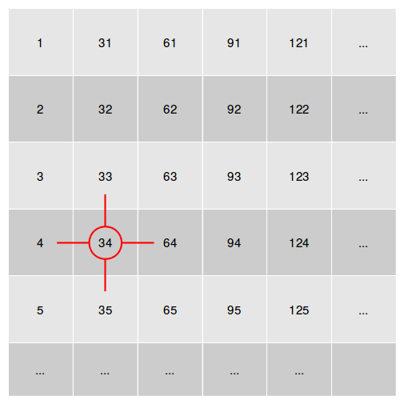

```{r setup, include = FALSE}
knitr::opts_chunk$set(
  collapse = TRUE,
  comment = "#>"
)
library(PhiMRF)
library(knitr)
```

## Introduction

The R package `PhiMRF` investigates the spatial dependency of count data under a Markov Random Field framework. The count data should be observed on discrete regular or irregular lattices in space.

## Model setup
First, let $y_{ik}$ be the observed variable at location $s_i$, $i = 1, \cdots, n$ from replicate $k$, $k = 1, \cdots, m$, we assume $y_{ik}\sim Poisson(\lambda_i)$. Let $w_i = log(\lambda_i)$. 

Second, we specify the distribution of $w_i$ conditionally,
\begin{equation}\label{eq: conditional}
    w_i|\boldsymbol{w}(N_i)\sim N(\mu_i,\tau^2)
\end{equation} where $N_{i}$ is the set of locations neighboring $s_i$: $N_{i}=\{s_j:s_j \mbox{ is a neighbor of } s_i\}$ and $\boldsymbol{w}(N_i) = \{w_j:s_j \mbox{ is a neighbor of } s_i\}$.

Third, the conditional normal distribution is *auto*-regressed on neighboring locations,
\begin{align}\label{eq: conditional2}
    \mu_i &=\alpha + \eta\displaystyle\sum_{j\in N_{i}}\dfrac{1}{|N_i|+|N_j|} (w_j-\alpha).
\end{align}
The normalizing constant $\dfrac{1}{|N_i|+|N_j|}$ serves to adjust the effects of different degrees of connection for different locations. 

Three unknown parameters exist in the model, $\alpha$, $\eta$ and $\tau^2$. $\eta$ symbolizes the strength of spatial dependency. The parameter space of $\eta$ is determined by the maximum and minimum eigen values of the adjacency matrix representing the neighborhood [@cressie1992statistics]. Let $a_0 < a_1 < \dots < a_n$ be the eigenvalues of adjacency matrix $A$, $\eta \in [l, u]$, then if $a_0>0$ or $a_n<0$, $l=1/a_n$ and $u = 1/a_0$; if $a_0<0$ and $a_n$>0, then $l = 1/a_0$ and $u=1/a_n$.

This package uses a Bayesian framework with constructed marginal distributions of $\boldsymbol{w}$ from the negpotential function [@kaiser2000construction]. The MCMC process follows a double Metropolis-hastings algorithm[@liang2010double].

See Zhou 2019 for details.


## Input
Two main categories of data must be supplied for the model: the pairwise distance relationship of the spatial locations, and the observations at each location.

### Spatial locations

The model takes any spatial relationships as long as the locations can be represented in an adjacency matrix. An example four-nearest neighbor regular lattice is given in `regular_lattice`. In this 30 $\times$ 30 regular lattice, each node is neighbor to its four neighbors in the four orthogonal directions. The nodes at the edges of the lattice wraps around from the other side. For example, the 34th location has neighbors of the 33th, 35th, the 4th and the 64th location, if the indices are arranged sequentially on the 30 $\times$ 30 lattice.

```{r echo=FALSE, out.width='40%', fig.show='hold'}

```

Because there is a total of 900 locations, the dimension of the adjacency matrix representing this lattice is 900$\times$ 900. An adjacency matrix $A$ is a (0-1) symmetric matrix with zeros on the diagonal. An element $A_{ij}$ equals to 1 if location $i$ and location $j$ are neighbors, while $A_{ij}$ equals to 0 if locations $i$ and $j$ are not neighbors. 

```{r}
dim(regular_lattice)
which(regular_lattice[34,]==1)
```

We provide a function `generate_four_nearest_neighbor_matrix` to output the adjacency matrix for a regular lattice of a given size. 
```{r}
# Below example outputs an adjacency matrix from a 5 by 5 lattice.
adj_mat_4nn_example = generate_four_nearest_neighbor_matrix(v = 25, k = 5)
dim(adj_mat_4nn_example)
```

Not only regular lattices could be represented by adjacency matrices. In fact, all undirected networks (graphs) could be represented as symmetric adjacency matrices. So even if your spatial locations are not observed on a regular lattice, but a network, they are accepted by this model.

We provide an example `irregular_lattice` in this package.
```{r}
dim(irregular_lattice)
#Counting number of edges by counting 
#number of all nonzero elements in the adjacency matrix 
#divided by two because the matrix is symmetric
sum(irregular_lattice>0)/2
```
There are 1000 observations in this network, connected by 1997 edges. We recommend using the `igraph` package for easy manipulation and visulisation of the network.
```{r}
library(igraph, warn.conflicts = F)
g = graph_from_adjacency_matrix(irregular_lattice, mode="undirected")
#number of vertices
vcount(g)
#number of edges
ecount(g)
```


### Transform the adjacency matrix
As mentioned in [Model Setup], we divide $\eta$ with a normalizing constant $(|N_i|+|N_j|)$, $i, j=1, \cdots n$ to adjust for the effects of different degrees of connection at different locations. In computation, this normalizing constant is applied to the adjacency matrix element-wise. In other words, the element $A_{ij}$ in the adjacency matrix is divided by its row sum ($N_i$) plus its column sum ($N_j$). This operation can be memory intensive for large matrices, see the section [For Large matrices] for solutions. For smaller matrices ($n<5000$), we provide a function `transform_small` for this transformation on the original adjacency matrix. The output is a matrix the same size as the original adjacency matrix, except the nonzero values are no longer 1, but a number between 0 and 1.

The function `transform_small` also automatically converts the adjacency matrix to the `dgCMatrix` format in the `Matrix` package, which is a sparse, column-oriented representation. The sparse format saves a lot of memory space and is required for later computation.

```{r}
regular_lat_trans = transform_small(regular_lattice)
class(regular_lat_trans)
# The dgCMatrix format takes up much less memory
object.size(regular_lat_trans)
object.size(regular_lattice)
```

To manually force a default matrix to the `dgCMatrix` class without transforming the nonzero values, you can use `methods::as(yourmatrix, 'dgCMatrix')`. 

To reverse-transform a transformed adjacency matrix in `dgCMatrix` format back to a traditional adjacency matrix with nonzero values being 1, you can take advantage of the sparse format, and coerce only the nonzero values back to 1.
```{r}
#number of non-zero values
nnz = length(attributes(regular_lat_trans)$x)
#copy
regular_lat_reverse = regular_lat_trans
#coerce the nonzero values to equal to 1
attributes(regular_lat_reverse)$x<-rep(1, nnz)
#Now the nonzero values equal to 1
which(regular_lat_reverse[34,]==1)
#In contrast, the nonzero values in the transformed matrix do not equal to 1
which(regular_lat_trans[34,]==1)
```

### Get parameter space of $\eta$ 

As mentioned in [Model Setup], the parameter space of $\eta$ is determined by the adjacency matrix, when we divided the $\eta$ by $(|N_i|+|N_j|)$, we have effectively inflated its parameter space. It is important for our later MCMC that we know the parameter space of $\eta$. We provide a function `get_eta_param_space_small` to compute the parameter space. 

**Please make sure to supply the *transformed* matrix for computation.**

The function calculates the eigen values of the adjacency matrix and can be memory intensive for big matrices. Do not attempt to run `get_eta_param_space_small` if your matrix is big, as it will crash your R session. Instead use the `preprocess_big` function, explained in detail in the [For large matrices] section.
```{r}
b_eta = get_eta_param_space_small(regular_lat_trans)
#In contrast, the original adjacency matrix has a much smaller parameter space
get_eta_param_space_small(regular_lattice)
```

### Observations $y$

The primary model assumption is that observations $y_i$ at location $i$, $i=1,\cdots,n$,   follows a Poisson distribution, i.e. $y_i\sim Poisson(\lambda_i)$. Only use this package if you think that this is the best model assumption for your observed data. 

Multiple observations can be made at the same location, e.g. $y_ik$, where $k=1,\cdots, m$ are assumed to be multiple replicates. Each replicate at each location are assumed to be conditionally independent of each other given neighboring locations, i.e. $y_{ik}\sim Poisson(\lambda_i)$.

The format of `y` is a $n \times m$ matrix, where $n$ is the number of locations and $m$ is the number of replicates at each location. Make sure your input is in `matrix` format even if $m=1$.

We provide a function `simulate_y` to simulate `y` from a given adjacency matrix.

```{r}
set.seed(23)
y<-simulate_y(n = nrow(regular_lattice), adj_mat = regular_lat_trans, 
              alpha = 2, eta = 1.5, tau2 = 2, m = 2, M = 2)
class(y)
dim(y)
```

**Caution!!** It is YOUR responsibility to make sure that the order of observations in the `y` matrix agrees with the order of locations in your adjacency matrix `adj_mat`. In other words, the $i^{th}$ row in the `y` matrix must be the observations taken at the $i^{th}$ location in `adj_mat`. It is very easy to re-order your matrices without realizing it, especially if your are taking subsets of a bigger matrix. For that, we recommend giving `rownames` to your `y` matrix as well as `rownames` or `colnames` to your `adj_mat`, and always check that they agree before running the model.

### For large matrices

Both the transformation of the adjacency matrix, and the parameter space calculation can be memory intensive for large matrices. We have therefore written a function that does both of these functionalities at the same time, taking advantage of the sparse matrix format. The computation is carried out in C instead of R. The input must be an *untransformed* matrix in the `dgCMatrix` class. The output is a list with two items, a vector `b_eta` for the eta parameter space and a `dgCMatrix` class transformed adjacency matrix `new_mat`. If a path is supplied, the results are also saved on disk in the "rds" format. 

```{r}
save_path = "./mats/"
irregular_lat_sparse = as(irregular_lattice, "dgCMatrix")
#save_path can be NULL
ret_preprocess = preprocess_big(irregular_lat_sparse, save_path)
# Check that the result agrees
sum(ret_preprocess$new_mat!=transform_small(irregular_lattice))
# Read the saved results back
adj_trans_read = readRDS(paste0(save_path, "adj_trans.rds"))
b_eta_read = readRDS(paste0(save_path, "bounds_eta.rds"))
```

## Run

The main function of our package is `pmrf` which performs the MCMC process for simulating from the posterior distributions of $\alpha$, $\eta$ and $\tau^2$ given observed data $\boldsymbol{y}$ and neighborhood structure $A$.


### Arguments
In addition to the input data, `y` and `adj_mat_trans`, some other arguments are required to run the `pmrf` function. Here is a list of all arguments required by `pmrf`.

- `total_iter`: total number of MCMC iterations

- `N`: Number of locations that data is observed. This should be equal to `nrow(y)`

- `y`:	Observed data as mentioned in [Observations $y$]

- `adj_mat`: **transformed** adjacency matrix in the `dgCMatrix` class, as mentioned in [Spatial locations]

- `vars`: Variances for the random walk proposal for the MCMC for each parameter, $\boldsymbol{w}$, $\alpha$, $\eta$ and $\tau2$. This should be vector of size four. Since $\eta$ uses an independence proposal instead of random walk, the third element of this vector is never used. 
- `bounds_e`: Lower and upper bound for $\eta$. See [Get parameter space of $\eta$] for details.

- `bounds_a`: Lower and upper bound for $\alpha$. Default `c(-10,10)`.

- `bounds_t`:	Lower and upper bound for $\tau$ (Not $\tau^2$).  Default `c(0,10)`.

- `inis`:	Initial values for $\alpha$, $\eta$ and $\tau^2$. Default `c(0.1,0.0,0.1)`.

- `wInis`:	Initial values for $\boldsymbol{w}$. Must be a vector of length `N`. Default `rnorm(N, inis[1], sqrt(inis[3]))`.
 
### Example
```{r, results = 'hide'}
n = nrow(y)
vars = c(2, 0.2, NA, 2)
ptm <- proc.time()
# We recommend total_iter of greater than 2000
Ti = 3000
ret = pmrf(total_iter = Ti, N = n , y, regular_lat_trans, vars = vars, b_eta)
et = proc.time() - ptm
```

```{r}
#time
print(et)
```


### Note
- Reference for time consumption: for the example dataset of $N=900$ and $m=2$, 2000 iterations of MCMC takes 219.42 seconds (~ 4 minutes) of elapsed time, 941.256 seconds of CPU time, on a machine with 8 cores. Parallel computation is built-in in this function.

- Reference for memory consumption: for the example dataset of $N=900$ and $m=2$, peak memory usage is less than 5GB.

- We recommend a large enough total iteration number ($>2000$), accounting for burn-in iterations. 


## Output

The output of `pmrf` is a list of results.

- `w`: matrix of `N` rows and `total_iter` columns. Posterior values of $\boldsymbol{w}$.

- `alpha`: vector of size `total_iter`. Posterior values of $\alpha$

- `eta`: vector of size `total_iter`. Posterior values of $\eta$

- `tau2`: vector of size `total_iter`. Posterior values of $\tau^2$

- `jump_count`: vector of size 4. Number of jumps for $\boldsymbol{w}$, $\alpha$, $\eta$ and $\tau^2$.

#### Step 1 

See whether the jump frequencies for each parameter falls within a desirable range (usually between 20\% to 60\%). We can tune the model using `vars` to change the jump frequencies.
```{r}
get_jump_frequency(ret = ret, Ti = Ti, N = n)
```

#### Step 2

Observe the posterior distribution to see if it converges successfully via trace plots. There are other metrics to assess the convergence of a MCMC sequence, such as the estimated Scale Reduction Factor [@brooks1998general].

```{r, fig.show='hold'}
plot(ret$alpha, ylab = "alpha", xlab="iteration")
plot(ret$eta, ylab = "eta", xlab="iteration")
plot(ret$tau2, ylab = "tau2", xlab="iteration")
```

#### Step 3

Remove burn-in iterations.
```{r}
B = 400
new_ret = delete_burn_in(ret, B)
```

#### Step 4

Obtain parameter estimates. The `print_param_estimates` functions outputs the mean and 95\% credible interval, in the order of $\eta$, $\alpha$ and $\tau^2$.
```{r}
print_param_estimates(ret, burn_in = B)
```


## References
